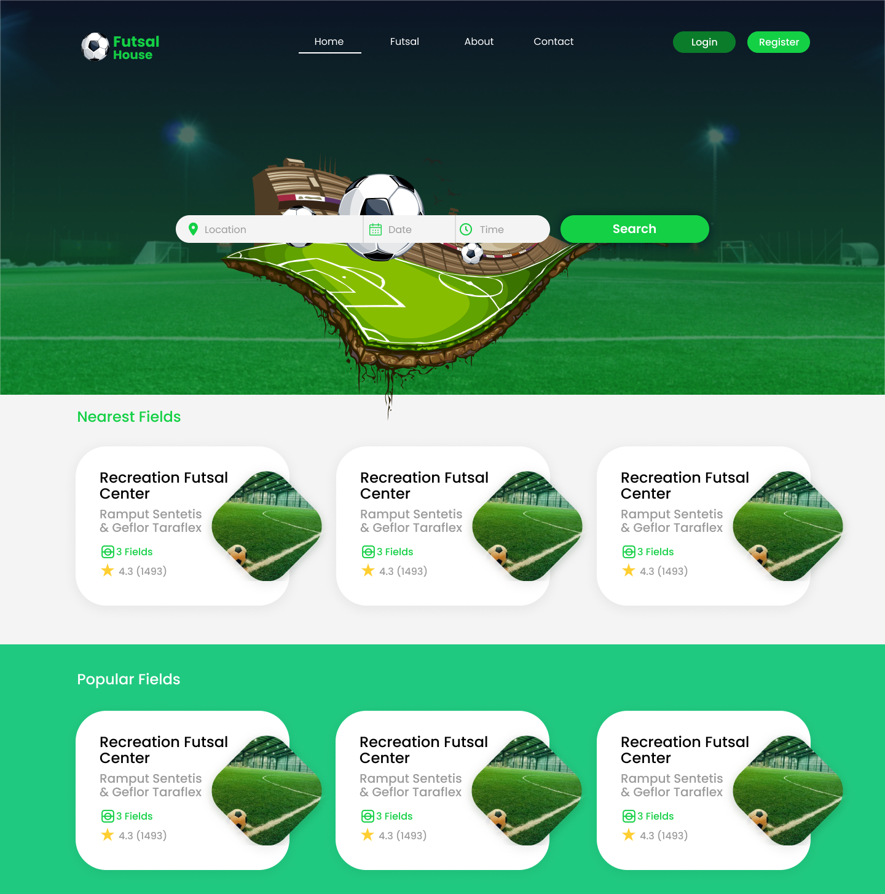

## Futsal House
<p align="center">
	
</p>

Futsal House, online Booking, Matching, Competing site for Futsal Players and Centres.


### Tech Stack
* Next.js
* TailwindCSS
* Auth0
* MongoDB
* Khalti
* eSewa


### MVP 
1. User Entity
2. Futsal Center Entity
3. Call to action button:
	* Picks Location, date & time and search
	* Gets list of futsal house.
	* Selects and pays online.

### Entities
1. User Entity
   User refers to futsal players who want to play a match.
   ```js
   user { 
	   first_name: "Rakesh",
	   last_name: "Rai",
   }
   ```

2. Futsal Center Entity
   ```js
   futsal_center { 
	   title: "Futsal Recreation Center",
	   description: "Best futsal center in town."
   }
   ```

